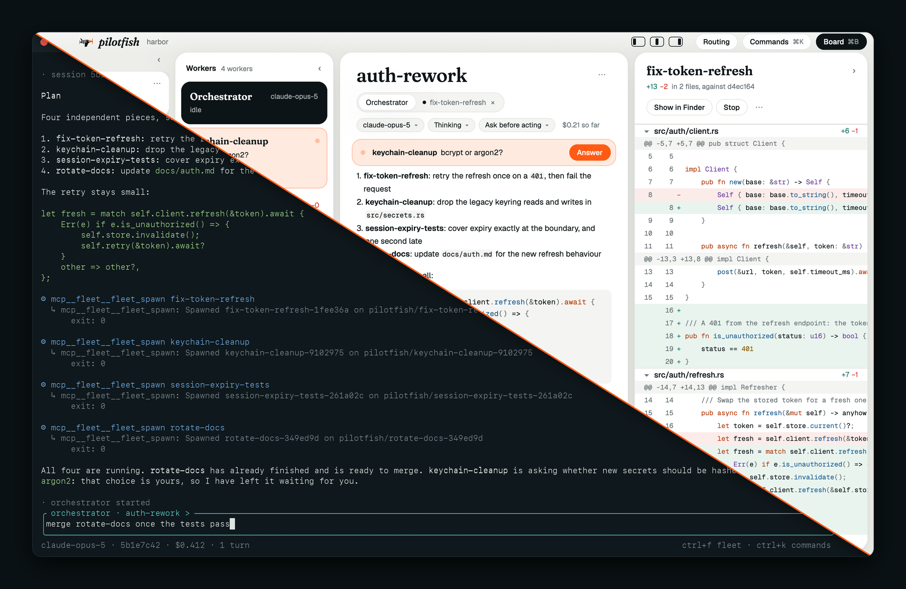
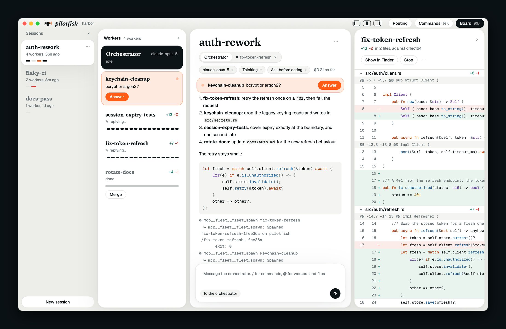
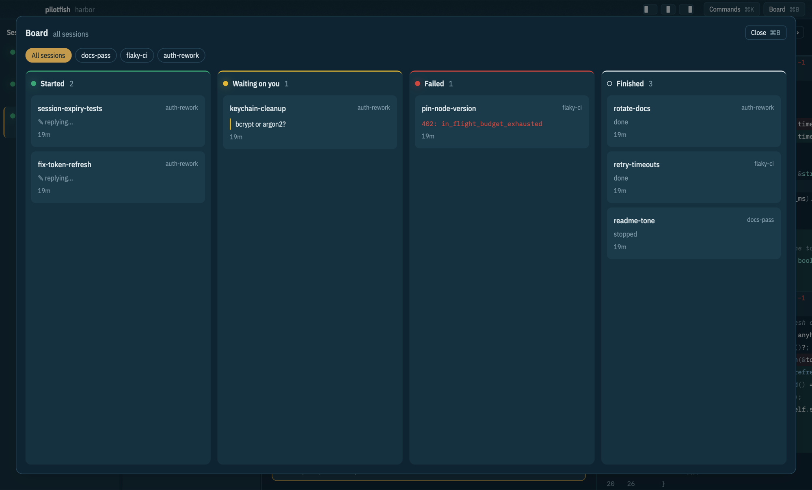
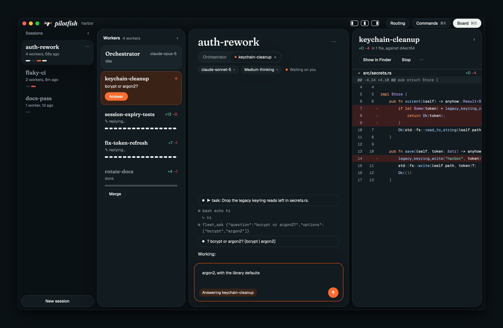
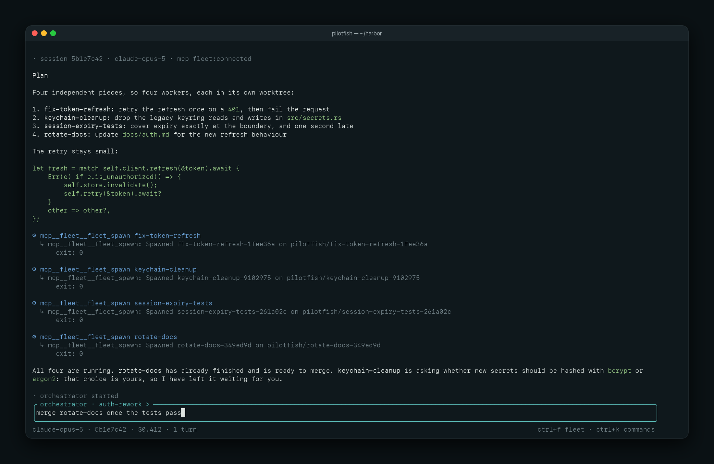
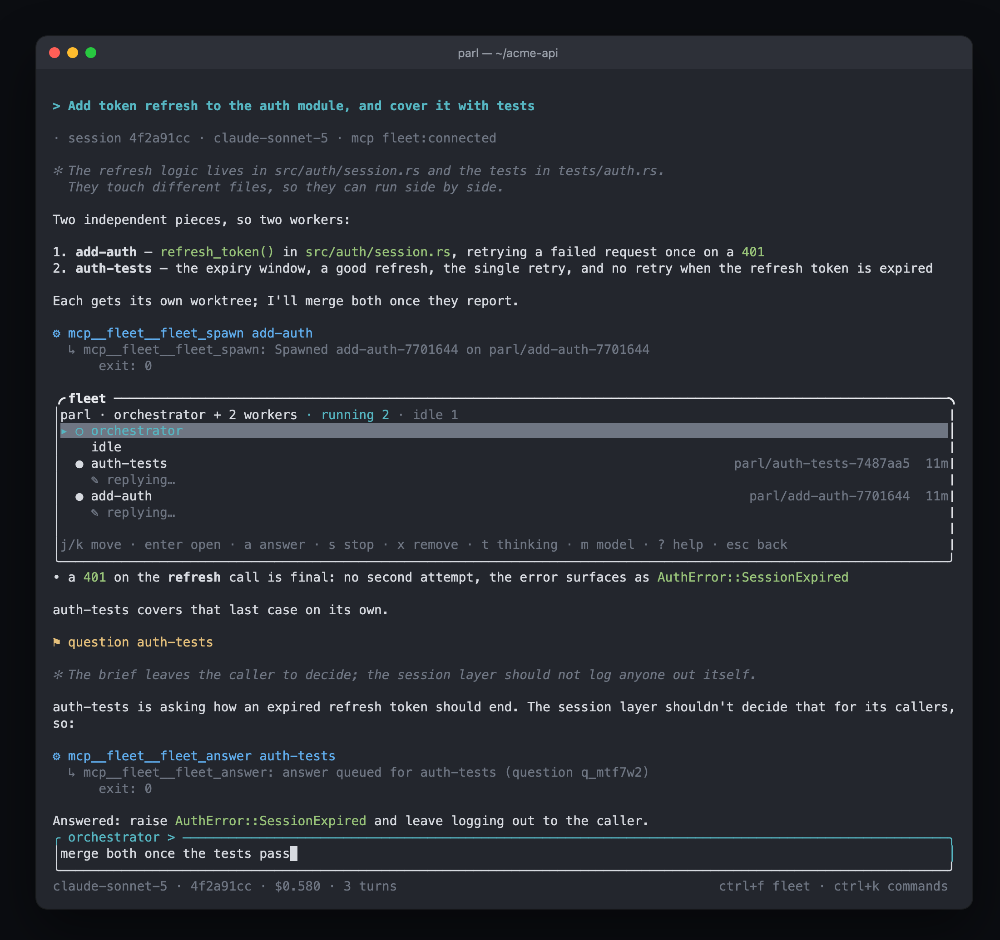
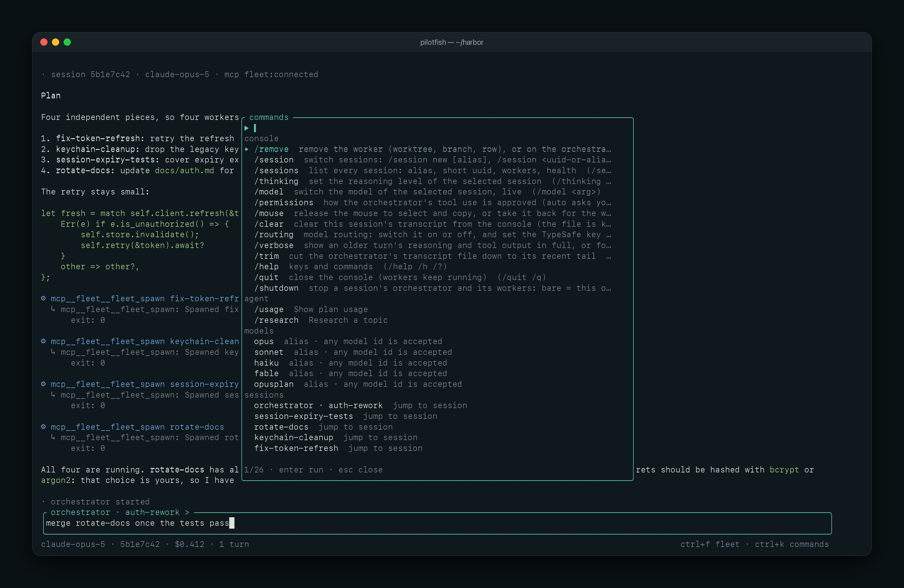

# pilotfish

`pilotfish` runs a fleet of [pi](https://github.com/earendil-works/pi-mono) coding agents, coordinated by Claude Code, from a desktop window or the terminal.



## How it works

You describe the work to an **orchestrator**, a `claude -p` process that plans the change but cannot edit files. It writes a brief for each independent piece and spawns one **pi worker** per brief, each in its own git worktree and branch. Workers report back when they finish. The orchestrator then reviews, merges and verifies their branches, and asks you when something is yours to decide.

* A session is one conversation with one orchestrator and its workers. A repository can hold several, and you start each one yourself.
* Every agent runs under a detached monitor that keeps its state in `.pilotfish/`. Close the window or the terminal mid-run and nothing stops. Reopen it and the session is where you left it.
* Any worker can be opened, steered, answered, stopped, merged or removed directly, and the orchestrator is told what you did.
* The desktop window and the terminal console are the same console over the same state, and only one of them can be open on a repository at a time. The `pilotfish` CLI drives the same fleet from scripts.
* Optionally, each worker's model and thinking level can be chosen from its brief, weighing capability against cost, with uncertain choices referred to you.

Requirements: a stable Rust toolchain, `pi` on your `PATH`, and Claude Code (`claude`, 2.1.x) signed in.

```bash
cargo install --locked --git https://github.com/SkymanOne/pilotfish                      # terminal console and CLI
cargo install --locked --git https://github.com/SkymanOne/pilotfish --features desktop   # plus the desktop window
```

## Desktop window

```bash
cd your-repo
pilotfish desktop
```



<p>


</p>

Sessions on the left, then the open session's workers, the conversation with rendered markdown, and the selected worker's live diff. Anything waiting on you, such as a worker's question or an approval, is pinned above the conversation with a button to answer it. Every command has a click: start, rename and remove sessions, switch models and thinking levels, answer, stop, merge and remove workers. ⌘B opens the Board, every session's workers in four lanes: started, waiting on you, failed and finished. The window follows macOS between a light and a dark theme.

The window is macOS-first and optional. Building it needs Xcode's Metal toolchain (`xcodebuild -downloadComponent MetalToolchain`). See [the desktop window](docs/desktop.md) for its layout, actions and keys.

## Terminal console

```bash
cd your-repo
pilotfish
/session new auth-rework
```



<p>


</p>

Start a session, then describe the task. The conversation fills the screen, and the fleet opens over it on demand.

| Keys | Action |
| --- | --- |
| `ctrl-f` | The fleet: every worker, with actions for the selected one (`a` answer, `s` stop, `x` remove, `m` model) |
| `ctrl-k` | Command palette: console commands, the agent's commands, models, sessions |
| `ctrl-r` | Search the conversation |
| `ctrl-o` | Expand older reasoning and tool output |
| `/help` | Every key and command |

The [console guide](docs/console.md) covers everything else: the fleet, permissions, sessions, model routing and the transcript. [Getting started](docs/getting-started.md) lists the launch options and configuration, and [the CLI reference](docs/cli.md) covers scripting (`pilotfish spawn`, `status`, `wait`, `merge`).

## Development

```bash
cargo build                                   # the terminal console and CLI
cargo build --features desktop                # plus the window (macOS, Metal toolchain)
cargo run --features desktop -- desktop --cwd ../some-repo   # try the window on another repository
```

Before a change lands, it must pass the same checks CI runs:

```bash
cargo fmt --all -- --check
cargo clippy --all-targets --all-features -- -D warnings
PILOTFISH_DIR=/tmp/pilotfish-canary cargo test --all-features   # the canary directory must stay empty
```

Tests drive fake `claude` and `pi` processes (`tests/fixtures/`, which need Node), never the real ones. [AGENTS.md](AGENTS.md) is the contributor reference: module layout, the on-disk contract, verified protocol facts, and the reasons behind the design.

## License

MIT. See [LICENSE](LICENSE).
